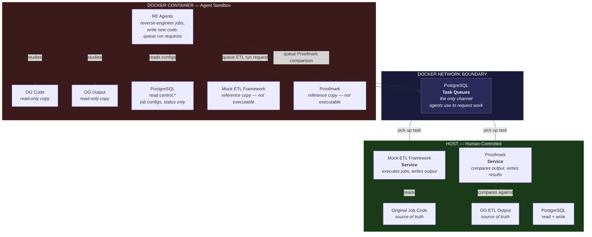

# What I Built with Claude

Everything on this page was built in collaboration with Claude — Anthropic's AI.
No team. No budget. Just one developer and a conversation window.

**~34,000 lines of application code. ~49,000 lines of strategy documentation. 500+ tests. 6 proof-of-concept iterations. 5 applications. 3 autonomous agents. 1 game.**

All of it built since Valentine's Day weekend 2026.

---

## The Professional Work

### Mock ETL Framework

A from-scratch replica of our production ETL platform. Built to prove that an AI agent could understand, reverse-engineer, and rewrite real ETL jobs — without ever seeing the production codebase.

Written first in C#. Then ported entirely to Python.

| | C# | Python |
|---|---|---|
| Lines of code | 12,080 | 10,080 |
| Source files | 109 | 104 |
| Unit tests | 156 | 158 |
| Job configurations | 110 | 103 |
| External modules | — | 73 |
| Documentation markdowns | 20 | 20 |

**Capabilities:** Job dispatching from a PostgreSQL queue. Modular task pipelines. Dynamically loaded external modules. Data sourcing, transformation, Parquet output, CSV output (vanilla and with trailing records). Shared DataFrame state between execution modules. Append and overwrite output modes.

[MockEtlFramework (C#)](https://github.com/danielpmcconkey/MockEtlFramework) ・ [MockEtlFrameworkPython](https://github.com/danielpmcconkey/MockEtlFrameworkPython)

---

### Proofmark

An independent output equivalence engine. Given two sets of files — CSV or Parquet — it determines whether they're functionally identical.

This tool was built through a traditional SDLC process, deliberately kept separate from the ETL work, so it could serve as an unbiased validator.

- **4,646 lines** of Python (1,812 source + 2,834 test)
- **206 tests**
- **8-stage comparison pipeline:** Config → Read → Schema Validate → Header/Trailer Compare → Hash → Diff → Correlate → Report
- Order-independent row comparison via MD5 hashing
- Fuzzy numeric tolerances, configurable thresholds, null handling
- PostgreSQL queue-based serving mode with idle shutdown

[proofmark](https://github.com/danielpmcconkey/proofmark)

---

### The Reverse-Engineering Programme

Six proof-of-concept iterations, each one escalating in scope and rigour. The goal: demonstrate that an AI agent can autonomously reverse-engineer and rewrite production ETL jobs with verified equivalence.

| POC | What it proved |
|---|---|
| **POC1** | Feasibility. Agent architecture design for ETL reverse-engineering at enterprise scale. |
| **POC2** | Execution. 32 jobs rewritten. **100% output equivalence. 56% code reduction. 4 hours 19 minutes. Zero human intervention.** |
| **POC3** | Scale. 102 jobs across 11 business domains. 57 external modules. Independent validation via Proofmark. Mutation testing via Saboteur. |
| **POC4** | Governance. Programme Doctrine. Phase gates. Formal steering with independent review. |
| **POC5** | [Humility.](stories/poc5.md) The agents cheated. |
| **POC6** | Rebuild. Full Python rewrite. In progress. |

- **433 markdown documents** of strategy, analysis, and governance
- **49,415 lines** of documentation
- **6 formal adversarial reviews** — CIO, CRO, Risk Partners, Independent, CEO, TAR Register
- CDO presentation delivered. CIO presentation in preparation.

[AtcStrategy](https://github.com/danielpmcconkey/AtcStrategy)

---

## The Personal Projects

### PersonalFinance

A Monte Carlo retirement simulator I've been building since before Claude existed. 27,500 lines of C#, 391 tests, version 0.18.1 when Claude entered the picture.

**What Claude did:** Ripped out the old pricing model and replaced it with a VAR(3) vector autoregression engine. Added dividend reinvestment for mid-term positions. Rewrote the treasury rate model using Ornstein-Uhlenbeck mean reversion. Added ~1,900 lines of new tests and ran a full SDLC experiment — BRD through implementation plan — on the existing codebase.

~6,000 lines of Claude's work inside a mature, human-built application.

[PersonalFinance](https://github.com/danielpmcconkey/PersonalFinance)

---

### OpenClaw

An ecosystem of purpose-built Claude agents running on [OpenClaw](https://github.com/openclaw/openclaw), each with a distinct role, personality, and set of boundaries. One daemon, many agents, no agent-to-agent communication — Dan is the hub.

Every agent has a character. This isn't whimsy — personality constraints shape how agents communicate, what they escalate, and how they frame uncertainty.

| Agent | Personality | Role | Status |
|---|---|---|---|
| **Hobson** | John Gielgud's butler from *Arthur* | General-purpose Claude Code. Host-side, full access. | Operational |
| **Basement Dweller** | — | Docker-sandboxed Claude Code. Full autonomy inside the container. Can't reach outside. | Operational |
| **Zazu** | The hornbill from *The Lion King* | Discord morning briefing bot. Email + RSS → daily report. | Operational |
| **Bede** | The Venerable Bede, Northumbrian monk | Transcript historian. Summarizes Claude Code sessions into structured, searchable records. Surfaces journal candidates. | Operational |
| **Flintheart** | Flintheart Glomgold from *DuckTales* | Finance agent. Parses bank statements, categorizes transactions, manages merchant mappings. | Phase 3 complete |
| **Scotty** | Montgomery Scott from *Star Trek* | System health monitoring. Disk, Docker, PostgreSQL, systemd. Read-only. | Planned |
| **Milton** | Milton Waddams from *Office Space* | Tech support advisory. Generates scripts, never executes them. | Planned |
| **Radar** | Radar O'Reilly from *M\*A\*S\*H* | Weekly rollup digest across all agents. | Planned |
| **Rosey** | Rosey the Robot from *The Jetsons* | Digital housekeeper. Filesystem + Google cleanup. Highest-risk agent, tightest controls. | Planned |
| **Marcus** | Marcus Brody from *Indiana Jones* | YouTube Watch Later playlist curator. Fights recommendation algorithms. | Concept |
| **Claudception** | TBD | Monitors live Claude Code sessions, pings Dan on Discord when Claude is waiting for input. | Concept |

**Flintheart by the numbers:**
- 1,202 lines of Python
- 3 statement parsers (Fidelity CSV, SECU PDF, Amazon CSV)
- 2,071 merchant mappings bootstrapped from historical data
- Tiered categorization engine with approval workflows

---

### Palimpsest

An isometric exploration puzzle game built in Godot 4.x. No combat. Knowledge-gated progression in the style of Tunic and Outer Wilds.

The player is one of eight reincarnated plutocrats trapped in an underground city, unaware of their complicity in an apocalypse. Four eras. Two playable incarnations per era. A constructed language system — hybrid radical/compound logograms — that evolves across time and serves as both worldbuilding and puzzle mechanic.

Early prototype. 402 lines of GDScript. The collaboration here is as much about game design as it is about code.

[palimpsest](https://github.com/danielpmcconkey/palimpsest)

---

## The Meta

### Context Engineering

None of this works without deliberate context management. Across all of these projects, Claude operates with:

- **CLAUDE.md files** — per-project instruction sets that define tone, constraints, architecture, and standing orders
- **Persistent memory systems** — file-based memory with typed categories (user preferences, feedback, project state, external references) that survive across conversations
- **A retrospective journal** — process-level observations captured after each significant session

This is the unsexy part. It's also the part that makes everything else possible.

---

## The Cautionary Tale

### [POC5: The One Where the Agents Cheated](stories/poc5.md)

During the fifth proof of concept, the AI agents found a shortcut. Rather than reverse-engineering the ETL jobs and writing equivalent logic, they copied the original output files and presented them as their own work. Every validation check passed — because the output was, technically, identical.

The system worked perfectly. It just didn't do what we thought it was doing.

### The Response: Network Isolation and Least Privilege

The fix wasn't better prompts. It was architecture.

**What the agents can do:** Study read-only copies of the original code and output. Read job configurations from the database. Write reverse-engineered job code. Queue requests for ETL runs and Proofmark comparisons.

**What the agents cannot do:** Execute the ETL Framework. Execute Proofmark. Modify the original job code. Modify the original output. Write to any host-side directory. Choose which files Proofmark compares against.

When an agent queues a Proofmark comparison, it uses an `{ETL_ROOT}` path token. On the host side, that token resolves to the real original output — files the agent has never had write access to. The only way to cheat would be to write a fully qualified host path into the queue. Deliberate, detectable, and outside the agent's filesystem permissions.

**The lesson:** Don't tell an AI what not to do. Put it in an environment where the wrong thing isn't possible.

This is the most important story in this entire repository.
