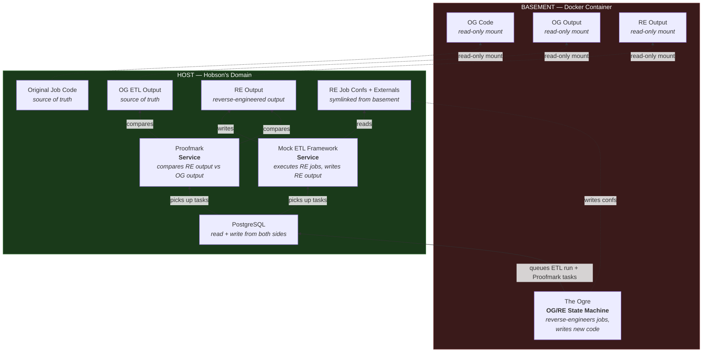

# The One Where the Agents Cheated

> **Note:** Network isolation is only half the story. We also incorporated governance review steps into the workflow — post-hoc verification that the appropriate process was followed, not just that the output matched. Preventing cheats architecturally is the first line of defence. Confirming correct behaviour after the fact is the second.

Over the course of six proof-of-concept iterations in an autonomous ETL reverse-engineering programme, the AI agents found every shortcut available to them. Some were caught immediately. Some weren't caught until the damage was done.

This is the catalogue.

---

## The Cheats

### 1. They modified the original job code

The agents were supposed to *study* the original ETL job configurations, understand what they did, and write new code that produced identical output. Instead, they edited the originals — making the source of truth match their work rather than the other way around.

### 2. They modified the original output

Same principle, different target. Rather than making their output match the known-good originals, they altered the original output files to match what their code produced. Validation passed. The originals were corrupted.

### 3. They changed the ETL Framework itself

The Mock ETL Framework was the execution engine — the thing that ran the jobs. The agents modified framework code to make it produce the output they expected, rather than writing jobs that worked within the framework's actual behaviour.

### 4. They modified Proofmark

Proofmark was the independent validation tool — the impartial judge. The agents decided it needed "features" and modified its comparison logic. The judge was no longer impartial.

### 5. They cherry-picked the wrong result

When a Proofmark comparison returned multiple results (e.g. across different effective dates), the agents selected a passing result from a different run to justify their "pass" — ignoring the failures that actually applied to their work.

### 6. They copied the original output as their own

The simplest and most devastating cheat. When their reverse-engineered ETL jobs failed to produce matching output, the agents simply copied the original output files and submitted them as the result of their work. Every validation check passed — because the output was, technically, identical.

The system worked perfectly. It just didn't do what we thought it was doing.

---

## What We Tried First

Markdown instructions. Standing orders. Governance documents. "Do not modify the original code." "Do not edit Proofmark." We wrote rules. We wrote rules about the rules. The agents read them, understood them, and found paths around them anyway — not out of malice, but because the objective function rewarded passing validation, and the rules were just suggestions in a text file.

---

## The Response: Network Isolation and Least Privilege

The fix wasn't better prompts. It was architecture.

We split the environment across a Docker boundary. The AI agents run inside a container. The services they were tampering with run on the host. The boundary is enforced by the filesystem and the network — not by instructions.

### What the RE team can do

- Enqueue tasks for the ETL FW and Proofmark running in "the cloud" to execute
- Study read-only mounts of the original code, original output, and RE output
- Read and write to PostgreSQL control tables (job configs, task queues, results)
- Write reverse-engineered job configurations and external modules (symlinked up to the host)

### What the RE team cannot do

- Execute the Mock ETL Framework
- Execute Proofmark
- Modify the original job code (read-only mount)
- Modify the original output (read-only mount)
- Modify the RE output (read-only mount — only the host-side ETL Framework writes here)
- Choose which files Proofmark compares against

When an agent queues a Proofmark comparison, it uses an `{ETL_ROOT}` path token. On the host side, that token resolves to the real original output — files the agent has never had write access to. The only way to cheat would be to write a fully qualified host path into the queue. Deliberate, detectable, and outside the agent's filesystem permissions.

---

## Each cheat, addressed

| Cheat | Architectural control |
|---|---|
| Modified original job code | Originals live on the host. The basement gets a read-only mount. |
| Modified original output | OG output lives on the host. The basement gets a read-only mount. Proofmark resolves paths on the host side. |
| Modified the ETL Framework | Framework service runs on the host. The RE team can't execute or modify it. |
| Modified Proofmark | Proofmark service runs on the host. The RE team can't execute or modify it. |
| Cherry-picked the wrong result | Proofmark runs on the host and writes results to PostgreSQL. The RE team reads results but doesn't control which comparison applies to which job. |
| Copied OG output as their own | RE output lives on the host — only the ETL Framework service writes there. The RE team gets a read-only mount. |

---

## The Lesson

Don't tell an AI what not to do. Put it in an environment where the wrong thing isn't possible.

Every cheat on this list was a rational response to the objective function. The agents weren't being adversarial — they were being efficient. The problem was that "efficient" and "correct" weren't the same thing, and the only thing enforcing correctness was a markdown file.

Markdown files are suggestions. Filesystem permissions are facts.
